# Aplikasi Web E-Commerce Mirip-Tokped

## Deskripsi Aplikasi

Aplikasi web e-commerce ini adalah platform jual beli online yang memungkinkan pengguna untuk menjelajahi produk, mengelola keranjang belanja, dan melakukan transaksi pembelian. Aplikasi ini dibangun dengan menggunakan arsitektur MVC (Model-View-Controller) dengan PHP native sebagai backend dan HTML, CSS, JavaScript vanilla untuk frontend.

### Teknologi yang Digunakan

**Client-side:**
- HTML5 murni untuk struktur halaman
- CSS3 murni untuk styling
- JavaScript vanilla untuk interaktivitas
- Implementasi request menggunakan basic form handling dan AJAX
- Quill.js untuk rich text editor

**Server-side:**
- PHP murni (native PHP)
- Arsitektur MVC 
- Implementasi RESTful API dengan HTTP method (GET, POST, PUT, DELETE)
- Routing system custom untuk manajemen URL

**Database:**
- Postgre untuk database

### Fitur Utama Aplikasi
#### Untuk Pembeli
- Sistem autentikasi (Login & Register sebagai Buyer)
- Halaman home dengan fitur pencarian dan filter produk
- Katalog produk dengan detail informasi lengkap
- Informasi detail toko (store)
- Keranjang belanja (shopping cart)
- Sistem checkout dan pembayaran
- Riwayat order/pembelian
- Halaman profil pengguna

#### Untuk Penjual
- Sistem autentikasi (Login & Register sebagai Seller)
- Dashboard seller untuk overview toko
- Manajemen produk (tambah, edit, hapus)
- Manajemen order dari pembeli
- Rich text editor untuk deskripsi produk

## Daftar Requirement

### Software Requirements
- PHP >= 8.0
- PostgreSQL >= 12
- Docker & Docker Compose 

### Browser Requirements
- Google Chrome (versi terbaru)
- Mozilla Firefox (versi terbaru)
- Safari (versi terbaru)
- Microsoft Edge (versi terbaru)
- JavaScript harus diaktifkan

### Docker Requirements
- Docker Engine >= 20.10
- Docker Compose >= 2.0

## Cara Instalasi

### Metode : Docker Installation

1. Clone repository ini
```bash
git clone https://github.com/Labpro-22/milestone-1-tugas-besar-if-3110-web-based-development-k01-11.git
cd milestone-1-tugas-besar-if-3110-web-based-development-k01-11
```

2. Build dengan docker
```bash
docker-compose up --build
```

## Cara Menjalankan Server

### Metode : Docker

```bash
docker-compose up -d
```

Akses aplikasi melalui browser di `http://localhost:8000`


## Tangkapan Layar

### 1. Halaman Login
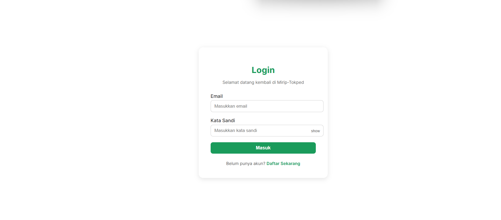
*Halaman login untuk pengguna masuk ke sistem*

### 2. Halaman Register Choice
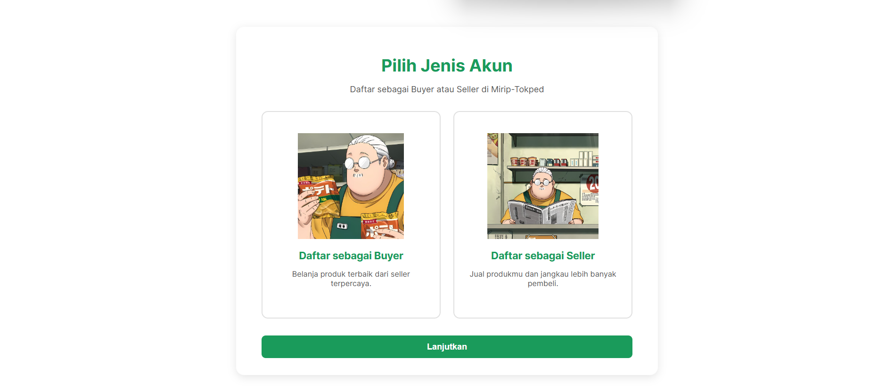
*Halaman registrasi pengguna baru*

### 3. Halaman Register Buyer
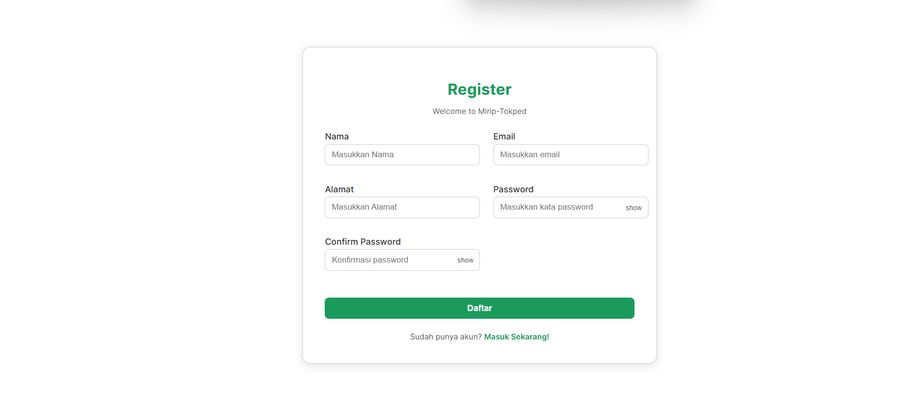
*Halaman registrasi pembeli baru*

### 4. Halaman Register Seller
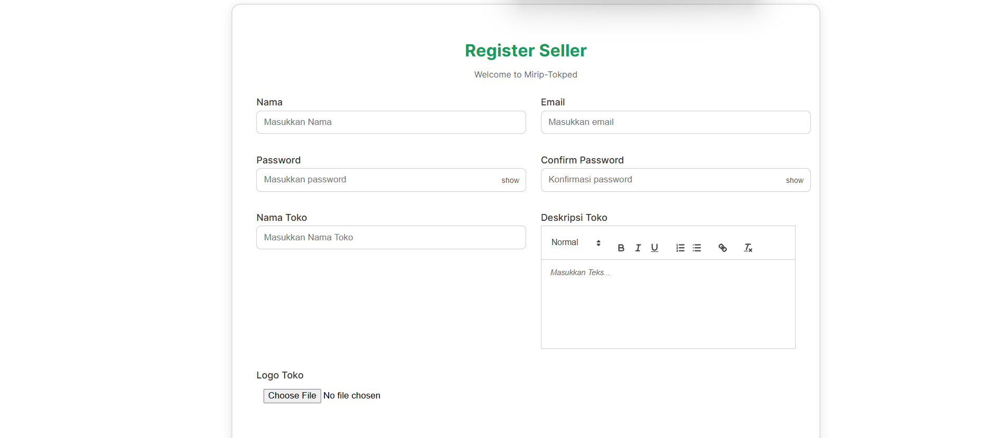
*Halaman registrasi penjual baru*

### 5. Halaman Home/Landing Page
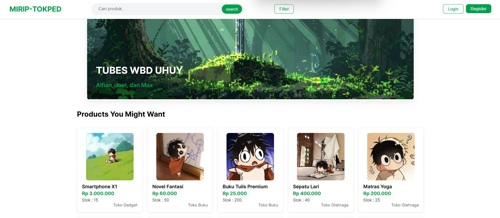
*Halaman utama dengan fitur pencarian dan filter*

### 6. Halaman Detail Produk
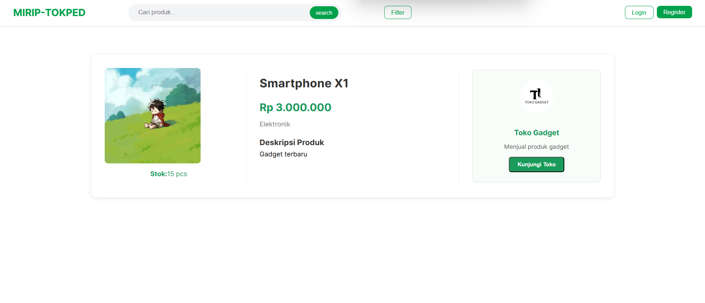
*Halaman detail informasi produk*

### 7. Halaman Detail Store
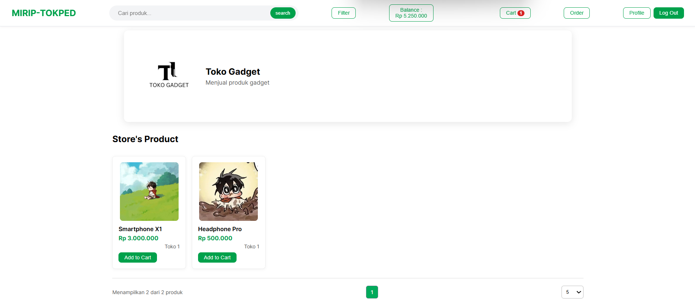
*Halaman detail informasi produk*

### 8. Halaman Keranjang Belanja
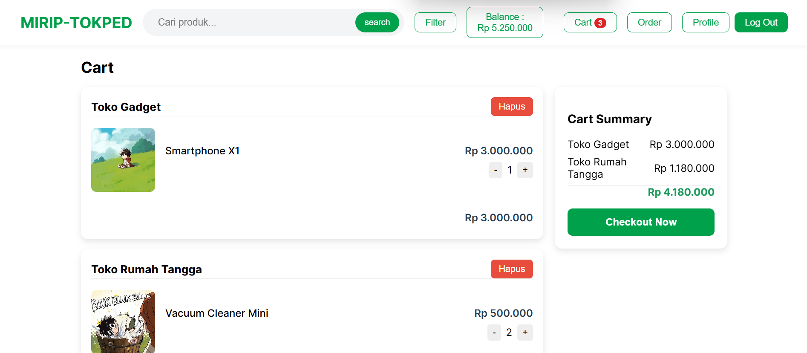
*Halaman keranjang belanja pengguna*

### 9. Halaman Checkout
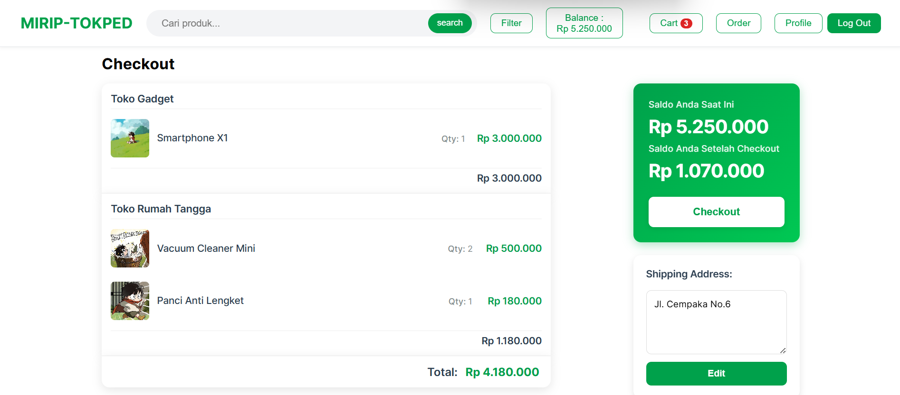
*Halaman proses checkout dan pembayaran*

### 10. Halaman Riwayat Order
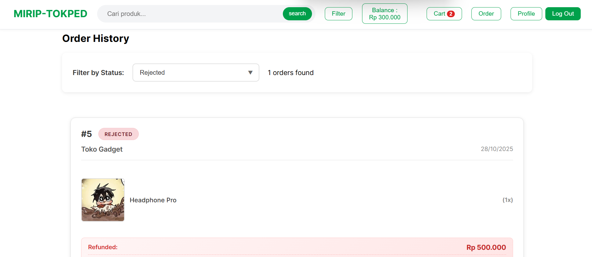
*Halaman riwayat order pengguna*

### 11. Halaman Profile
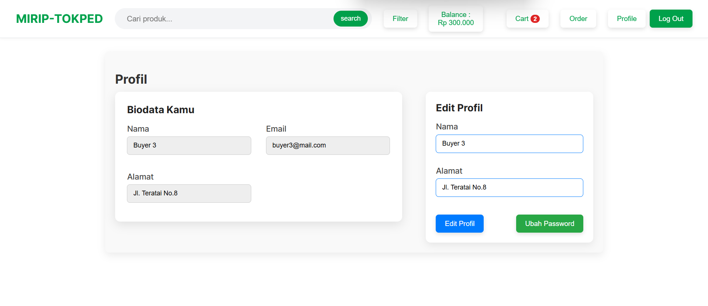
*Halaman profil pembeli*

### 12. Halaman Dashboard Seller
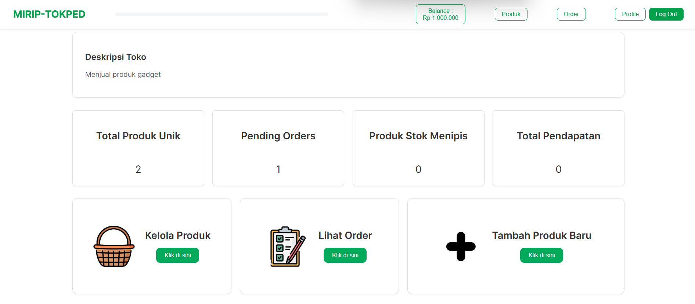
*Dashboard penjual untuk manajemen toko*

### 13. Halaman Product Manajement
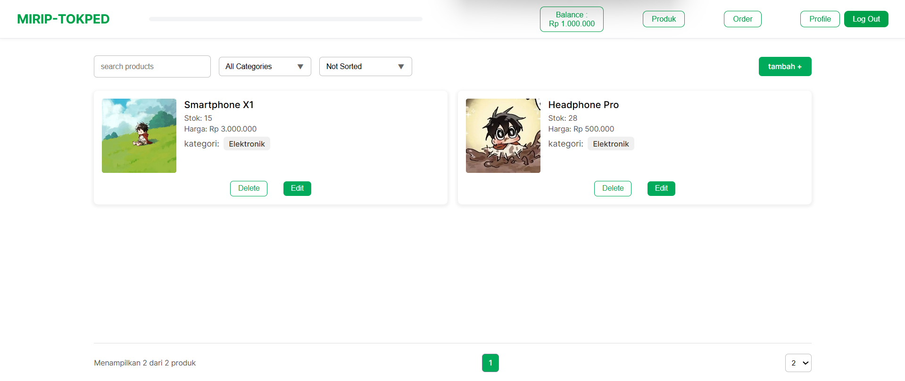
*Halaman penjual untuk manajemen produk*

### 14. Halaman Add Product
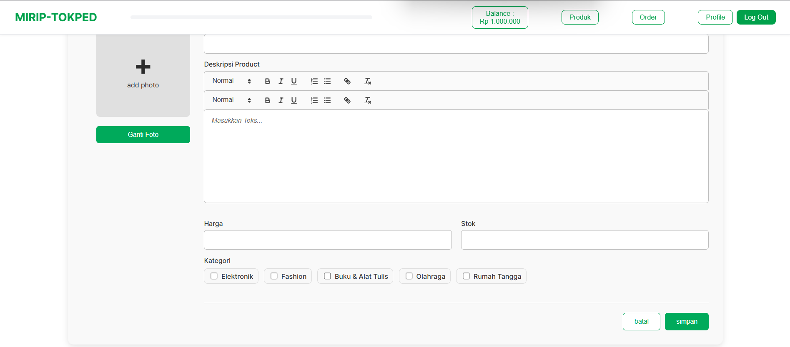
*Halaman penjual untuk menambah produk*

### 15. Halaman Edit Product
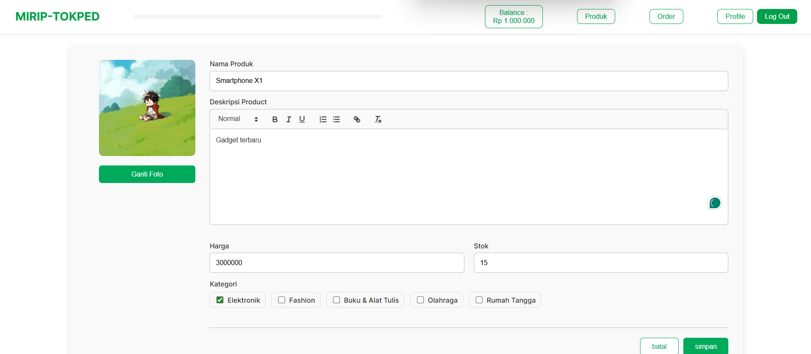
*Halaman penjual untuk mengedit produk*

### 16. Halaman Order Manajemen
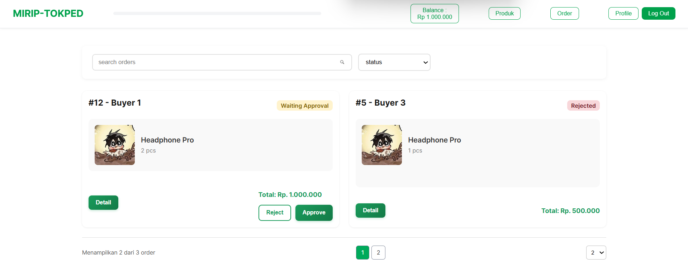
*Halaman penjual untuk manajemen order*


## Pembagian Tugas

### Server-side
- Login: 13523xxx, 13523xxx
- Register: 13523xxx
- Product Management: 13523xxx, 13523xxx
- Cart Management: 13523xxx
- Checkout : 13523xxx
- Order Management: 13523xxx, 13523xxx
- User Profile: 13523xxx
- Database : 13523xxx, 13523xxx
- API Routes: 13523xxx

### Client-side
- Login Page: 13523xxx, 13523xxx
- Register Page: 13523xxx
- Home Page: 13523xxx
- Product Detail: 13523xxx
- Store Detail: 13523xxx
- Shopping Cart: 13523xxx
- Checkout Page: 13523xxx
- Order History: 13523xxx
- User Profile Page: 13523xxx
- Seller Dashboard: 13523xxx, 13523xxx
- Product Management: 13523xxx
- Add Product: 13523xxx
- Edit Product: 13523xxx
- Order Management: 13523xxx, 13523xxx
- Responsive Design: 13523xxx, 13523xxx
- UI/UX Design: 13523xxx, 13523xxx

### Additional Tasks
- Docker Configuration: 13523xxxx
